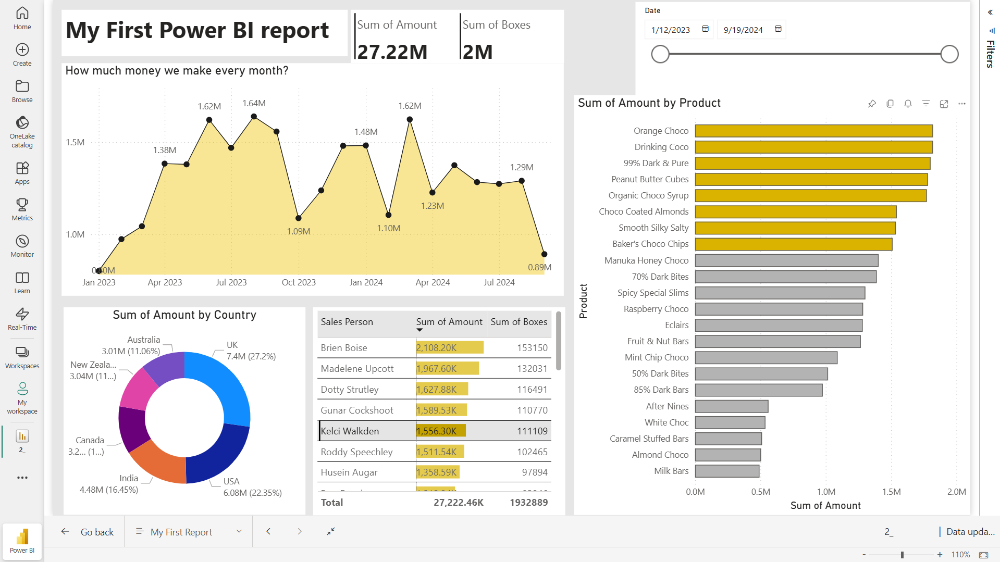

# 🍫 Chocolate Sales Analysis

This project analyzes chocolate sales data using **Excel** and **Power BI** to identify key trends, patterns, and insights.  
It demonstrates data cleaning, transformation, and visualization skills relevant for **Data Analyst** roles.

---

## 📂 Project Structure
- `data/` → Contains the raw dataset (`.xlsx`).
- `reports/` → Contains the Power BI report (`.pbix`).
- `images/` → Screenshots of dashboards for quick view.
- `README.md` → Documentation of the project.

---

## 🔑 Key Insights
- Top-performing products and regions.
- Monthly/quarterly sales trends.
- Contribution of product categories.
- Revenue performance analysis.

---

## 🛠 Tools Used
- **Excel** → Data exploration & cleaning
- **Power BI** → Data visualization & dashboard creation
- **GitHub** → Project version control & sharing

---

## 📸 Dashboard Preview


---

## 🌐 Live Report
You can interact with the published dashboard here:  
👉 [View Power BI Report](https://app.powerbi.com/view?r=eyJrIjoiM2I4YTBhZGYtZjlhMi00NWRkLTkwOTAtNGNiZWYyZTdiNGVmIiwidCI6IjQ0OTVhMDhhLWQ4ZmUtNGRhYy1hNGI3LTFkN2E0NTYxYWE4NiJ9)


---

## 🚀 How to Use
1. Clone the repository:
   ```bash
   git clone https://github.com/saurav-kumar-cse/Chocolate-Sales-Analysis.git
   ```
2. Open `data/2_sample-chocolate-sales-data-1.xlsx` in Excel for raw data.
3. Open `reports/2_sample-chocolate-sales-reports.pbix` in Power BI Desktop to explore the dashboard.

---

## 📜 License
This project is licensed under the MIT License - see the [LICENSE](LICENSE) file for details.
